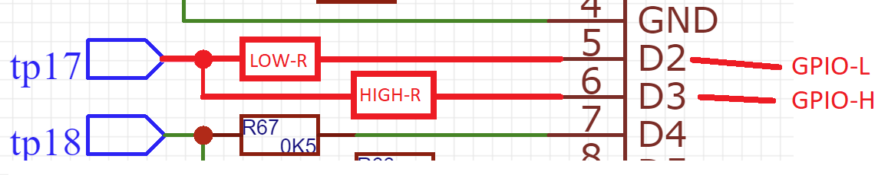
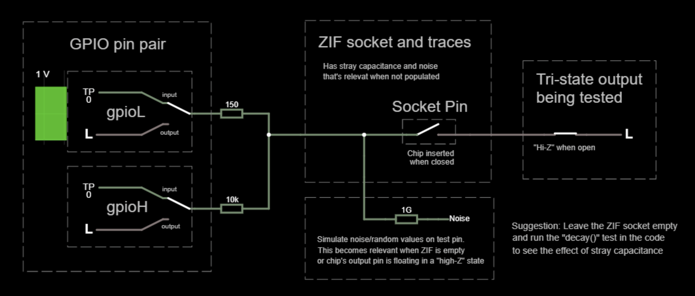

Integrated Circuit Tester
=========================

This software accompanies a hardware design for an integrated circuit tester.

Hardware design and pcbcan be found on EasyEda : https://easyeda.com/john.lonergan.sharing/integrated-circuit-tester

**Unusual features of this implementation**:
- verifies correct functioning of tristate outputs
- able to differentiate equivalent logic devices that differ terms output type; open collector outputs vs regular push-pull outputs eg 7405 vs 7404

Motivation
------

There were various motivations for building this:
- To test a bunch of chips I bought from eBay and AliExpress
- To allow me to check my understanding of the functioning of certain interesting and rarely mentioned logic chips.
- To learn something about Arduinos
- To learn about EasyEda
- To have some fun getting a PCB made up (not having to etch it myself like the old days) 
- Nostalgia - I built something with a similar function at university in 1984 but it was a much bigger physically and hooked up to a BBC PC.

This device was not intended to be used to identify IC's as I can read that off the top of the chip. However, the device can operate in identification mode if needed.

Summary
------

This device is intended to test 74** series chips but will work equally well with 4000 series CMOS or other 5v chips that don't need much supply current.

This device can also be used to test drive a pattern on an LED array or 7 segment display, with visual inspection to check the device's behaviour is correct. Note that the LED must be able to tolerate the forward current resulting from the inline two 150R resistors (approx 15mA). 

Usage
=======

Step1: Test case specification
---------

Specify a sequence of test cases using the following pin codes. These codes define the inputs and the expected outputs from the test subject.

Settings

   - V=VCC of chip under test (set gpioL to high; set gpioH to high)
   - G=GND of chip under test (set gpioL to low ; set gpioH to low)
   - 1=set input pin of chip under test to logic high
   - 0=set input pin of chip under test to logic low
   - C=clock pin will be toggled from 0 to 1 to 0 during the test case

Additional settings:
   - /=a spacer you can use in the input pattern as a separator for example for ease of reading groups of pins or for whatever else you like
   - u=identifies any unused pins and is added automatically by the program to fill in any pins the test says the chip isn't using - this pin will be tested for high impedance - don't typically need use this code yourself as it is effectively same as 'Z' 

Expectations
   - L=expect logic low output from chip under test
   - H=expect logic high output from chip under test
   - Z=expect high impedance output from chip under test
   - X=dont care - pin gets set with a weak pull down
   - S=sample and display the signal at the pin, giving either 1 or 0 as the result; floating pins will give unpredictable values according to any stray charge on the pin
   - ?=read the signal at the pin by applying a pullup/down to confirm it's state as one of 1/0/Z

For example the test case "111G/HHHV" would mean... test an 8 pin chip with pins 1-3 all as inputs set to logic 1, pin 4 will be the GND pin, pin 8 is Vcc, and we expect pins 5,6,7 to be outputs with logic high.

An interesting test case is to leave the ZIF socket empty, apply a "1" on all test pins, then over a period of seconds  sample the 24 pins using "S" once per second. What you see is a decay of the charge on the pins over a few seconds. See the section below on stray capacitance. See also the 'decay' test case in the software.

Test results
--------

The test results use these codes:
   - .=a pass for that pin - ie expected output was found
   - H=a LOW or Z was expected but HIGH was found
   - L=a HIGH or Z was expected but LOW was found
   - Z=a HIGH or LOW was expected but Z was found
   - 1=the test pattern was ? and the value detected was 1
   - 0=the test pattern was ? and the value detected was 0
   - _=identifies the pin as an input so there's no test result on this pin
 
Also, a hack ...
   - -=identifies the top two pins of the socket - in my inital design there's a hardware fault on those so I dont put the chip in the top position. This is only relevant if using the original hardware. In the later revision this bug is corrected by using different pins for the first row of the Zif.


Step 2: Setup the hardware
-----

Connect the tester circuit to the computer over the USB port and enable the serial console with the correct baud rate.

Place the chip being tested into the ZIF, placing the chip against the top of the ZIF.

:x: If you are using the original revision of the board, then the top row of pins must be avoided. Just sit the chip in row 2 of the ZIF instead. This problem is now corrected in EasyEda.

Step 3: Run the test
-----

Edit the software to run whatever mode you are after. It's defined in the setup function. 

Options are:

- Identification - where the device runs through a database of test cases to identify the chip
- Interactive - where tests can be entered on the serial console 
- Plus there are a couple of modes in miscTests.ino to do with testing LED arrays and also the interesting capacitance decay test mentioned elsewhere in this documentation. 

Upload the program to the Arduino Nano.

Observe the test results in the serial console. 

See the section "Test results" above for a decoding of the test output.

What I learned
====

Voltage Levels
------

-  HC logic chips data sheets say VCC may be as low as 2v typically
-  HCT data sheets quote 4.5v as lowest Vcc but this is merely the min in order to maintain TTL compatibility. In reality HCT will run fine at lower Vcc.
- LS will also run at lower voltages.
  
  See http://www.ti.com/lit/an/sdya009c/sdya009c.pdf - _Texas Instruments - Designing With Logic_
  
  Section 2.2 Behavior With Low Supply Voltages: _"TTL devices attain stability with a supply voltage of about 3.5v, and are fully functional at a typical voltage of 4v"_

HC/HCT/LS will all run fine at lever voltages than 5v. This is handly because there will be a voltage drops below 5v when powering and driving the test chips from the GPIO pins. 

On the Zif socket I measured a voltage of 4.7v-4.8v with a 5v supply. This voltage drop was less than I expected. 
- The MCP23017 extender documents a high level output voltage of Vdd-0.7v, but perhaps thats a conservative value or perhaps I was measuring test pins driven by the Arduino...
- The ATmega328P documentation guarantees a high of at between 4.7v and 4.8v on a 5v supply at 10mA load. 2mA would be 4.9v or more. See page http://ww1.microchip.com/downloads/en/DeviceDoc/Atmel-7810-Automotive-Microcontrollers-ATmega328P_Datasheet.pdf "Figure 29-10. I/O Pin Output Voltage versus Source Current"

In anycase it's convenient that I'm seeing reasonable voltages on the Zif vs the needs of the various logic families.


EasyEda
-----

- Its fun
- Its time sink
- The power and ground lines should be made wider than defaults - use design rules 
- Tweak the default track separation and track width so they are more robust and lower resistance - use design rules
- Check the design rules violations list for clearance errors before committing

Arduino Nano
-----

- There is sufficient capacitance on the GPIO pins and lines out to the Zif socket that writing to a disconected pin (empty Zif) and then reading that same pin returns the logic level that was previously written, rather than a random value. See below for more information.
- The analog A6/A7 lines cannot be used as digital outputs, just digital inputs only
- The I2C pins SCL/SDA are open collector and need pull ups - but see more below
- D13 is connected via a 1k resistor and an LED to ground so this can interfere with it's reliability as a digital input due to the pull down. IF it is to be used at al then it is intended to be used as an output. 
- The header pins supplied with the Elegoo Arduino nano don't fit in a round pin DIP socket and the header pins are made of a metal that doesn't solder easily
- There is a lot of confusing discussion on whether one needs to add pullups to the I2C bus lines

__Do I or don't I need pullup resistors on the I2C lines SDA/SCL?__ 
There is a lot of confusing info on this online.

Firstly, I found this explanation of why some kind of pullup MUST be present ....
 
- _"I2C bus drivers are "open drain", meaning that they can pull the corresponding signal line low, but cannot drive it high. Thus, there can be no bus contention where one device is trying to drive the line high while another tries to pull it low, eliminating the potential for damage to the drivers or excessive power dissipation in the system. Each signal line MUST HAVE a pull-up resistor on it, to restore the signal to high when no device is asserting it low."_
 
However, the I2C pins on the Ardunio have optional pull-up resistors. Conveniently, the Wire library turns on the internal pull up resistors in it's twi_init() called by Wire.begin() function on SDA & SCL. Doing this puts a weak-pull up on the I2C pins even though they are acting as outputs. Further digging explains that it is possible to have these digital input pull-ups turned on despite the pins acting as I2C outputs because the digital IO circuitry that contains the pull-up is in parallel to the I2C IO circuitry so they are not exclusive. Convenient!

And, for a physically short bus and where the voltages on each end are the same then a design doesn't need additional external pullups on the I2C pins.

**Stray Capacitance test result**

I tested what would happen if I left the Zif socket empty then set the GPIO as output and wrote a 1's to all the pins. I then turned the pins into inputs and measured the logic level every few seconds to to see what unfolded.  

I've included the test results for my soldered PCB below.

```
Initial test case to charge the pins...
Testcase :  1111111111111111111111

Then Sample the pins over a period...
Testcase :  SSSSSSSSSSSSSSSSSSSSSS

Result   : -1111111111111111111111- : 0 secs
Result   : -1111111111111111111111- : 1 sec
Result   : -1101111111111111111111- : 2 secs
Result   : -0001111111111111111000- : 6 secs
Result   : -0000000000000110000000- : 10 secs
Result   : -0000000000000010000000- : 15 secs
Result   : -0000000000000010000000- : 20 secs
Result   : -0000000000000000000000- : 25 secs
```

Further run ...
```
Testcase :  1111111111111111111111
Result   : -1111111111111111111111- : 0 secs
Result   : -1111111111111111111111- : 1 sec
Result   : -1001111111111111111111- : 2 secs
Result   : -0001111111011111111000- : 6 secs
Result   : -0000000100000111000000- : 10 secs
Result   : -0000000000000010000000- : 15 secs
Result   : -0000000000000010000000- : 20 secs
Result   : -0000000000000010000000- : 25 secs
```

What I see is that reading the pins echo's back the logic levels that were written to them moments before. We can see that at time passes the memory decays and the pins gradually start reporting logic 0. This decay consistently takes  around 25 seconds to complete.

Running this same test over and over I found that the  pattern of decay to 0 was somewhat similar on each test run. I guess this is a consequence of each path having it's own unique RC.

Initial, I couldn't see how the numbers add up to be an RC effect. I assumed this effect is explained by stray capacitance on the PCB traces and the Zif socket coupled with a slow discharge via the 100M&Omega; inputs. But, if the combined capacitance of the pin (*1), plus traces on the PCB, plus the Zif socket is aroung 20pF and the input is 100M&Omega; this still doesn't produce a significant RC value; it's a tiny 0.002 seconds. 

I posted this conundrum onto [this project's Hackaday.IO log](https://hackaday.io/project/169707-integrated-circuit-tester-tristate-too) and Ken Yap commented that CMOS inputs can be up to 10^12 &Omega; and when I put that number into the equation then I ended up with an RC value of 20 seconds.

This "memory" effect really confused me for ages and for quite a while I thought I had a hardware bug or had damaged one of the devices. 

(*1 "Zif sockets can add 8pF" see ["EMC at Component and PCB Level" 5.1.5 Component Sockets](https://books.google.co.uk/books?id=__zOzV7Kd-MC&pg=PA106&lpg=PA106&dq=%22zif%22+socket+%22capacitance%22&source=bl&ots=un8Jfz-B4g&sig=ACfU3U26ntpdDMNau6HHNYnmF4ISwuBBbg&hl=en&sa=X&ved=2ahUKEwjzpvT636znAhXUi1wKHYkKDSkQ6AEwBHoECDAQAQ#v=onepage&q=%22zif%22%20socket%20%22capacitance%22&f=false))

Principal of operation 
=====

This circuit is designed to be able to power a low power logic device and also to determine if the device is healthy. It does this by applying a sequence of known inputs and verifying the expected outputs.

The circuit is designed to verify regular H and L outputs but is also capable of verifying that a pin is in a high impedance "high-Z" state. 

Two GPIO pins are dedicatd to test each pin of the chip under test. These two GPIO pins are each configured with an inline resistor and the rest of the dicsussion will refer to them as  
- "GPIO-L" - the GPIO pin with a low low in-line resistor 
- "GPIO-H" - the GPIO pin with a high value in-line resistor

Together these two GPIO pins provide a single “test pin” that is attached to the pin of the chip under test.



**GPIO-L and GPIO-H operate as a pair in one of three modes:**

- **Driving an input** or **Power supply input to chip being tested**
  
  Where the test subject’s pin is expected to be either a logic input, or  GND/VCC, then GPIO-L is set to a L or H output. Set H for Vcc or for a logic 1 input and set L for GND or a logic 0 input. 
  
  GPIO-H is not relevant in this use case and it is configured as a high  impedance (input) state.
 
- **Testing an output**
  
  This test can distinguish a logic 1 from a logic 0 from a high-Z

  GPIO-L is set as an input to sense the test pin, and gpipH is set as an output. 

  This test relies on the fact that if the test chip's output is asserting a 1 or 0 then this signal would swamp a small pull up or pull down applied if it were applied to the same wire. This explains the purpose of the GPIO-H line which has a high value resistance. GPIO-H can be used to attempt to pull the wire up or down during the tests. If the circuit is sucessfully able to pull the pin both up and down then this can only be possble if the pin is in a high Z or disconnected state. 

  Two tests are then performed
  - GPIO-H is set to High to apply a weak pull-up to the test chips pin and GPIO-L reads the result
  - GPIO-H is set to Low  to apply a weak pull-down to the test chips pin and again GPIO-L reads the result 
  
  If both the pull-up & pull-down events are sensed by GPIO-L then this indicates that the test pin is in a high impedance state. If however we only sense a L during both tests then the test pin must be asserting a 0, and if only a H is sensed then the test pin must be asserting a 1.

  :white_check_mark: It ought also be possible to detect an open collector output in a similar manner. When the open collector output is asserting a 0 then the pull-up/down test will fail and will always sense a L, but when the open collector output is logic 1 then it's output will be floating and the pull up/down check ought to be sucessful.

- **Sample mode**

   Both GPIO-L and GPIO-H are configured as inputs and the state of the test pin is read via GPIO-L. GPIO-H is not relevant in this use case. 
   
   In this mode no pull up or pull down is applied by GPIO-H, so instead we simply see the result of whatever voltage happens to be present on the test pin. If the test socket isn't populated then this voltage will be stray capacitance or perhaps electrical noise so the signal is unreliable if there is nothing attached. This mode isn't particularly useful but it is used by an interesting experiment around stray capacitance (see the *decay()* test in the software); that capacitance experiment is described above in the "*What I learned*" section.  
  
Demo
----

:star: [Click here to use interactive demo](http://tinyurl.com/skrhf8r) 

[](http://tinyurl.com/skrhf8r)

Choice of resistor values
-------

__GPIO-L__

The resistor on GPIO-L is present solely to provide over-current protection. However, one of the modes of use for the test pins is to drive VCC and GND of the test subject, so this resistor has to be low enough that it can source and sink sufficient current that the test chip will operate correctly.

However, the resistor can't be so small that it fails to provide short circuit protection to the GPIO pin.

So we want the resistor to be a low value, but not too low.

In the end I went for 150R in the implementation because I figured all current paths would have at least two serial resistors meaning the path would typically be 2x150R=300R meaning about 15mA would pass at 5v. 

This is probably unreliable logic because in some errant cases the shorted pins and their resistors might be in parallel and the effective resistance will be reduced, but I figure it's good enough. 

__GPIO-H__

GPIO-H is used solely in the high-Z detection use case where it acts as a weak pull up/down and in all other tests GPIO-H is disabled and plays no part. 

The high value resistor on GPIO-H is chosen so that this pin can apply a mild pullup/pulldown to the chip under test during that Z output state testing.

__Implementation__

Low Res : 150R
- drives VCC, GND plus regular logic inputs
- senses H/L/Z outputs 

High Res : 10k
- drives pullup/down during high-Z tests

NB: The high level voltage on the Zif socket is approx 4.8v.

NB. This whole thing is probably over engineered and/or under engineered, but I've built it and it works. I suspect that some cheap IC identification devices on eBay probably don't bother with series protection resistors at all and almost certainly can't detect tri-state devices - but I could be wrong. Leaving out either of these features would be a big simplification for me but I wasn't happy with the omitting short circuit current limiting resistors, which seem advisable when running the device in circuit identification mode where the software has no idea what's in the socket.  

NB. Worst case CMOS output resistance about 50 &Omega; and will typically be a lot less - http://www.ti.com/lit/an/scla007a/scla007a.pdf

Software
========

The approach I've chosen is to use the serial console of the Arduino IDE as the interface to the test circuit. 

You load the test program into the the Arduino IDE, edit the code trivally to select the test plan for the chip you are interested in and then send the program to the Arduino to run the tests.

Feedback on the test results is reported by the Arduino back to the serial console of the IDE. 

NB. Make sure the baud rate in the console matches the program.

I used the Arduino Nano and this doesn't support a file system so I can't include an onboard file with the test cases. Instead, I compile these into the Arduino program (sketch).

Other databases of tests
===============

The format of the test cases used here is somewhat compatible with https://github.com/akshaybaweja/Smart-IC-Tester. This implementation differes in that it also supports tri-state detection capability.


VSCode Setup
============

If you want to use VSCode instead of the Arduino IDE ...

https://cuneyt.aliustaoglu.biz/en/enabling-arduino-intellisense-with-visual-studio-code/

ALSO https://github.com/microsoft/vscode-arduino/issues/891

VSCODE formatting that I used :     _"C_Cpp.clang_format_fallbackStyle": "{ BasedOnStyle: Google, IndentWidth: 4, ColumnLimit: 0, AllowShortBlocksOnASingleLine: true}"_

How to fix the excessive arduino logging in VSCode
--------

"It seems the excessive debug logging is caused by running Java with -DDEBUG=true. Adding -DDEBUG=false to the C:\Program Files (x86)\Arduino\arduino_debug.l4j.ini fixes it for me."

See https://github.com/microsoft/vscode-arduino/issues/891
